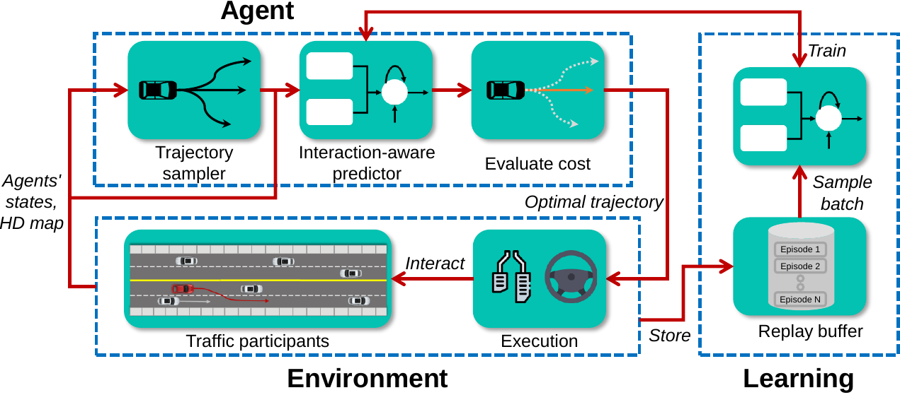

# Predictive-Decision-making

This repository contains the code for the following paper:

**Learning Interaction-aware Motion Prediction Model for Decision-making in Autonomous Driving**
<br> [Zhiyu Huang](https://mczhi.github.io/), [Haochen Liu](https://scholar.google.com/citations?user=iizqKUsAAAAJ&hl=en), [Jingda Wu](https://wujingda.github.io/), [Wenhui Huang](https://scholar.google.co.kr/citations?user=Hpatee0AAAAJ&hl=en), [Chen Lv](https://scholar.google.com/citations?user=UKVs2CEAAAAJ&hl=en) 
<br> [AutoMan Research Lab, Nanyang Technological University](https://lvchen.wixsite.com/automan)
<br> **[[arXiv]](https://arxiv.org/abs/2302.03939)**

If you are looking for or interested in our winning solutions (Team AID) at [NeurIPS 2022 Driving SMARTS Competition](https://smarts-project.github.io/archive/2022_nips_driving_smarts/), please go to [track 1 solution](https://github.com/MCZhi/Predictive-Decision/tree/smarts-comp-track1) and [track 2 solution](https://github.com/MCZhi/Predictive-Decision/tree/smarts-comp-track2).

## Framework
We propose an interaction-aware predictor to forecast the neighboring agents' future trajectories around the ego vehicle conditioned on the ego vehicle's potential plans. A sampling-based planner will do collision checking and select the optimal trajectory considering the distance to the goal, ride comfort, and safety. The overall framework of our method is given below.



## Results
Examples of our framework navigating in various scenarios are shown below.
### Left turn
https://user-images.githubusercontent.com/34206160/204998517-16b5fe6d-c342-42b4-bba6-d0b7a0ea3c7c.mp4

### Merge
https://user-images.githubusercontent.com/34206160/204999331-6425b1ae-4cc6-4b11-90e9-21b5f84f95fa.mp4

### Overtake
https://user-images.githubusercontent.com/34206160/205000341-42c50dd7-ec4f-42fd-8a36-3965332bc13d.mp4

## How to use
### Create a new Conda environment
```bash
conda create -n smarts python=3.8
```

### Install the SMARTS simulator
```bash
conda activate smarts
```

Install the [SMARTS simulator](https://smarts.readthedocs.io/en/latest/setup.html). 
```bash
# Download SMARTS
git clone https://github.com/huawei-noah/SMARTS.git
cd <path/to/SMARTS>
git checkout comp-1

# Install the system requirements.
bash utils/setup/install_deps.sh

# Install smarts with comp-1 branch.
pip install "smarts[camera-obs] @ git+https://github.com/huawei-noah/SMARTS.git@comp-1"
```

### Install Pytorch
```bash
conda install pytorch==1.12.0 -c pytorch
```

### Training
Run `train.py`. Leave other arguments vacant to use the default setting.
```bash
python train.py --use_exploration --use_interaction
```

### Testing
Run `test.py`. You need specify the path to the trained predictor `--model_path`. You can aslo set `--envision_gui` to visualize the performance of the framework in envision or set `--sumo_gui` to visualize in sumo.
```bash
python test.py --model_path /training_log/Exp/model.pth
```
To visualize in Envision (some bugs exist in showing the road map), you need to manually start the envision server and then go to `http://localhost:8081/`.
```bash
scl envision start -p 8081
```

## Citation
If you find this repo to be useful in your research, please consider citing our work
```
@article{huang2023learning,
  title={Learning Interaction-aware Motion Prediction Model for Decision-making in Autonomous Driving},
  author={Huang, Zhiyu and Liu, Haochen and Wu, Jingda and Huang, Wenhui and Lv, Chen},
  journal={arXiv preprint arXiv:2302.03939},
  year={2023}
}
```
